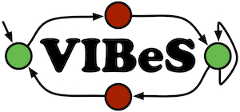

This project aims at providing a framework to perform behavioural testing of SPLs.

# Project structure

Structure separates the framework modules from the different executables jars created using those modules.

* vibes: The root project with the website content
	* vibes-core: The models definition core lib
	* vibes-execution, vibes-mutation, ... : The different modules defined to perform various testing activities
	* vibes-dsl: The dsl definition to simply use the different modules (each library has its dsl classes defined in a separate package)
	* vibes-toolbox: The module containing all executable jars built using the framework. Each executable jar is defined as a sub-module. Executables MUST be defined as vibes-toolbox SUB-MODULES.

